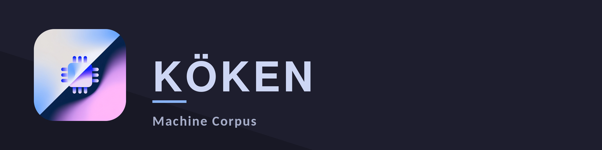

<p align="center" width="100%">
    
</p>

<h1 align="center">KÖKEN</h1>
<p align="center"><strong>Machine Corpus</strong></p>

<p align="center">
  
  
</p>

<p align="center">
  
  
  
</p>

---

## 1. DESCRIPTION

KÖKEN shows you what your computer is made of, and tells you what each thing
means.

Every Linux system already has tools that will print your hardware details. They
print them in the same shorthand the kernel uses, so you end up with a screen
full of things like `1002:747e`, `x8`, and `Mitigation: Enhanced / Automatic
IBRS`, and then you go and search for what those mean. KÖKEN prints the same
details, and puts the explanation one click away.

Click any row and it opens in place, underneath, with a few sentences on what
the value is and why you might care. Around seventy rows have one so far,
chosen because they are the ones people actually stop and look at:

- how many memory channels you are really running, which is the difference
  between full speed memory and half speed memory, and which nothing else
  warns you about
- whether your graphics card got all the lanes it asked for, or half of them
- how worn your laptop battery is, which is not the percentage your desktop
  shows you
- what your drive thinks of its own health, and how many hours it has been
  running - which on a second-hand drive is often not what the seller said
- whether Secure Boot is actually on

It reads. It does not change anything, with one exception you have to confirm
twice, described in section 4.

It never uses the network. Not for updates, not for looking anything up, not
for anything at all. Unplug the cable and it works exactly the same.

There are no benchmarks, no reports to export, no graphs over time, and no
settings screen. It shows you what is there.

---

## 2. DEPENDENCIES

KÖKEN needs six things. This section explains why each one is there, and why
there are only six. There is also exactly one *optional* extra, which section
2.1 covers on its own - the application runs without it and nothing installs it
for you.

The short version: everything on this list does real work that would otherwise
have to be written badly by hand. Nothing on it is there for convenience.

### `python` 3.11 or newer

The program is written in Python. Version 3.11 specifically, because that is
the version where reading the file format the explanations are written in
became part of Python itself. On 3.10 it would need an extra library to read
one small text file, which is not a good trade.

### `pyside6`

The windows, the buttons, the text. This is Qt, which is what KDE is built on,
and it is the part of KÖKEN you actually look at.

It does a second job that is less obvious: it is also how KÖKEN talks to the
two system services it needs, one for disk health and one for finding out
whether your desktop is set to light or dark mode. Because Qt already includes
that, KÖKEN does not need a separate library for it.

**On Debian and Ubuntu this is four packages, not one.** Debian splits Qt into
one package per part, so you install `python3-pyside6.qtcore`,
`python3-pyside6.qtgui`, `python3-pyside6.qtwidgets` and
`python3-pyside6.qtdbus`. That is expected. Installing the `.deb` pulls all
four in for you.

### `hwdata`

Two text files that the whole Linux world shares, listing what every piece of
hardware ever made calls itself. They turn `1002:747e` into
`Navi 32 [Radeon RX 7700 XT / 7800 XT]`.

KÖKEN could ship its own copy of those files. It does not, because they are
updated constantly as new hardware appears, and a copy frozen at release day
would start failing to recognise hardware within months. Yours is kept up to
date by your system.

If a piece of hardware is not in the list, KÖKEN shows the raw numbers and says
plainly that there is no entry for it. It never guesses a name.

### `udisks2`

Disk health. Drives keep their own records - how long they have been running,
how hot they get, whether they expect to fail - and reading those records needs
administrator access.

`udisks2` is already on almost every desktop Linux system, already runs as a
service, and already knows how to ask for permission properly. Using it means
KÖKEN does not need a second privileged program of its own just for disk
health, and it works the same way for both older SATA drives and NVMe drives.

It is also what performs the mount and unmount described in section 4.

### `dmidecode`

Your motherboard's firmware writes a table describing the machine: which memory
modules are in which slots, their part numbers, their speeds, and the serial
numbers of the board and the system.

There is no other way to read it. The kernel does not publish this anywhere,
for anyone, in any form. `dmidecode` is the only tool that reads that table, and
it is the single exception to KÖKEN's rule about not running other programs and
reading their output.

### `polkit`

The thing that asks you for your password, once, at startup.

It is what lets a normal program request one specific privileged action without
the whole program running as administrator - which would be both dangerous and,
on Wayland, broken outright.

### What is deliberately not here

- **`python-dbus`** - Qt already includes what is needed to talk to system
  services. A second library doing the same job would be a second thing to
  install and a second thing to go wrong.
- **`pciutils` and `usbutils`** - these provide `lspci` and `lsusb`. KÖKEN
  reads the same files those tools read, directly. Running another program and
  picking apart its printed output is fragile: it breaks whenever that program
  changes how it prints, and it cannot tell you anything the program chose not
  to print.
- **`smartmontools`** - not required, and not installed by KÖKEN. It is
  *optional*, and section 2.1 below explains the one thing it adds.

### One thing that ships inside

The small icons in the interface - the little symbols on device tabs and on
warning rows - are a font. It is a thirty-symbol slice of
[Tabler Icons](https://tabler.io/icons), which is free software under the MIT
licence, and it is fourteen kilobytes. Its licence is in `LICENSE-tabler`.

It is a font rather than a folder of pictures for a plain reason: symbols drawn
as text take the colour of the text around them, so they change with the theme
by themselves.

## 2.1 ONE OPTIONAL EXTRA: `smartmontools`

There are six required dependencies and exactly one optional one. KÖKEN runs
perfectly well without it, and no package manager will pull it in for you: the
Arch package lists it under `optdepends` and the Debian package under
`Suggests`, both of which mean "you may want this", not "you need this".

**What you get with it.** Under `Storage` there is a tab called `SMART`, with
one entry per drive. With `smartmontools` installed, that tab shows the drive's
complete attribute table - every counter the drive keeps about itself, by name
and by number, with the drive's own normalised, worst and threshold values and
the raw reading beside them:

```
  5 Reallocated_Sector_Ct     24 — value 100, worst 100, threshold 10
  7 Seek_Error_Rate           4295032833 — value 8, worst 8, threshold 45
  9 Power_On_Hours            12500 — value 86, worst 86, threshold 0
  194 Temperature_Celsius     38 °C — 38 (Min/Max 20/45) — value 62, worst 45
  197 Current_Pending_Sector  8 — value 100, worst 100, threshold 0
```

The counters that actually predict a failure - reallocated sectors, pending
sectors, uncorrectable errors, cable CRC errors, flash wear - are coloured when
they are not zero. Anything that has crossed the threshold the drive itself
publishes is coloured more strongly again. Those thresholds are the drive's,
not KÖKEN's: nothing here invents a number and calls it a limit.

NVMe drives have no attribute table - the standard replaced it with a health
log - so the same tab shows that instead: percentage of rated endurance used,
available spare against the drive's own spare threshold, data written, media
errors, unsafe shutdowns.

**What you lose without it.** That table, and nothing else. Every other SMART
value in the application comes from `udisks2` over D-Bus and is unaffected: the
health verdict, the temperature, the power-on hours, the reallocated sector
count, the number of attributes past their threshold and the last self-test
result all still appear on the `Disks` tab exactly as before. The `SMART` tab
still lists every drive; each one says that the table needs `smartmontools` and
why.

**Why it is needed at all,** when `udisks2` reads SMART already: `udisks2` will
hand over the attribute table, but only in a data type that Qt maps to an
opaque container which this Python binding cannot read - attempting to unpack
it terminates the process. Every other SMART value comes back in a type the
binding handles. So KÖKEN asks `udisks2` first, every time, and falls back to
`smartctl` only for the table.

**What it costs you.** One command, `smartctl`, run once at startup by the same
privileged helper that reads the memory table, inside the same password prompt
you already answered. No daemon, no background monitoring, nothing added to
your startup. If you install Debian's `smartmontools` package it does bring the
`smartd` monitoring daemon with it - KÖKEN neither uses nor starts it, and that
is exactly why the dependency is a suggestion rather than a recommendation.

**A drive that is asleep is left asleep.** KÖKEN passes `-n standby`, which
tells `smartctl` to check the drive's power mode first and give up if it is
parked. Opening a hardware browser should not spin up your laptop's disk. Such
a drive's tab says so, and the table appears the next time you look after the
drive has been used.

**Some drives will not answer whatever you install.** A USB enclosure usually
cannot: most bridge chips do not pass SMART commands through to the drive
behind them. Card readers generally report nothing at all. In both cases the
tab shows what `smartctl` itself said about that device rather than a guess.

---

## 3. INSTALLATION

### 3.A From source

You need Python 3.11 or newer, and the six things in section 2.

On Arch:

```bash
sudo pacman -S python pyside6 hwdata udisks2 dmidecode polkit git
git clone https://github.com/sudo-megas/KOKEN.git
cd KOKEN
python -m koken
```

On Debian or Ubuntu:

```bash
sudo apt install python3 python3-pyside6.qtcore python3-pyside6.qtgui \
                 python3-pyside6.qtwidgets python3-pyside6.qtdbus \
                 hwdata udisks2 dmidecode policykit-1 git
git clone https://github.com/sudo-megas/KOKEN.git
cd KOKEN
python3 -m koken
```

**Running from source is not quite the finished thing.** The password prompt
at startup will ask for the administrator password rather than your own,
because the rule that says "this specific program may do this specific thing"
is only installed when you install a package. Everything works; the prompt just
looks different. If you would rather it did not ask at all, press cancel - see
section 4.

### 3.B As a package for your distribution

Download the file for your system from the
[releases page](https://github.com/sudo-megas/KOKEN/releases), then:

**Arch, and anything built on it** - CachyOS, EndeavourOS, Manjaro:

```bash
sudo pacman -U koken-1.0-1-any.pkg.tar.zst
```

**Debian, Ubuntu, and anything built on them** - Mint, Pop!\_OS:

```bash
sudo apt install ./koken_1.0-1_all.deb
```

Use `apt install ./file.deb` rather than `dpkg -i`. The `apt` form installs the
four Qt packages KÖKEN needs at the same time; `dpkg` does not, and leaves you
to work out what is missing.

Either way, KÖKEN appears in your applications menu afterwards.

### 3.C Anything else

There is no Flatpak, no Snap, no AppImage, and no `pip install koken`.

That is not an oversight. KÖKEN's entire job is reading your machine, and a
sandboxed package is deliberately prevented from doing exactly that. A Flatpak
version would be able to show you almost nothing.

If you use a distribution that is not in the list above, install from source as
in 3.A. Everything KÖKEN needs is in every distribution's repositories under
one name or another.

---

## 4. HOW TO USE? WHAT IS THE APPLICATION SECTIONS?

Start it from your applications menu, or type `koken` in a terminal.

There are four sections along the top. Choosing one changes the row beneath it,
and choosing from that row changes the row beneath that. Click any row of
information to open its explanation.

| Section | What is in it |
|---|---|
| **Hardware** | Your processor - cores, threads, clock speeds, cache, what instructions it supports, and which known processor flaws affect it. Your memory - how much, how fast, which slots are filled, and how many channels are actually in use. Your graphics cards, each one on its own tab. Your monitors, including when each was manufactured. Your motherboard and its firmware. |
| **System** | Which Linux distribution this is and which version, every package installed on it and whether you asked for it or something else pulled it in, and which program opens which kind of file. Which kernel, which flavour of it, and every setting it was started with. Your desktop session, which graphical toolkit each installed application is built on, and which portal backend handles each request your desktop makes. And a security page: Secure Boot, kernel lockdown, device isolation, and the protections your kernel has switched on. |
| **Storage** | Every drive, with its model, serial number, and its own health report - including how many hours it has been running. Every partition, with what is on it, how full it is, and where it is attached. A SMART page carrying each drive's full attribute table, one row per counter the drive keeps, with the ones that predict a failure picked out. Everything currently mounted, and your swap space. |
| **Peripherals** | Everything plugged in: USB devices, everything on the internal PCI bus, network connections with their speed and traffic counters, sound cards, keyboards and mice, batteries and power, and every temperature and fan sensor the machine has. |

### Getting a value out

Move your pointer over any row and a small copy symbol appears at the right.
Click it and that value goes to your clipboard, ready to paste into a search
box or a support form.

You get the plain value, not the explanation next to it. A row reading
`16 — SMT enabled` copies `16`.

That is the whole of getting information out of KÖKEN. There is no export, no
report, and no save. One value at a time.

### Keyboard

| Key | What it does |
|---|---|
| `Ctrl` + `1` to `4` | Jump to Hardware, System, Storage or Peripherals |
| `Tab` and `Shift` + `Tab` | Move through the second row |
| `←` and `→` | Move through the third row |
| `F5` | Look again, including for hardware plugged in since it started |
| `Ctrl` + `Q` | Quit |

### How often it looks

Along the bottom you can choose how often KÖKEN re-reads the things that
change - temperatures, clock speeds, free space. `Off`, or every 1, 2, 5 or 10
seconds. It starts at 2 seconds, and remembers your choice.

Things that do not change on their own - which devices exist, model numbers,
capacities - are only re-read when you ask. The **Refresh** button at the
bottom left does that, and so does `F5`. So if you plug a drive in while KÖKEN
is open, press Refresh to see it.

### The password prompt

**KÖKEN asks for your password once, when it starts.** This is the only time.

It asks because three things cannot be read otherwise: the details of your
memory modules, your machine's serial numbers, and the firmware version of an
AMD graphics card. A small separate program reads those three things, prints
them, and exits immediately. It runs for well under a second and it is the only
part of KÖKEN that ever runs with administrator rights.

**You can press cancel.** KÖKEN opens normally and everything else works. The
rows that needed it say `Requires administrator access — restart KÖKEN to
authenticate`, and it does not ask again or nag you about it. The bottom of the
window shows that you declined.

### Mounting and unmounting

This is the one thing KÖKEN can change about your machine.

Go to **Storage → Volumes** and pick a partition. The first row shows where it
is attached, or that it is not attached at all, and on the right of that row is
a button.

**One click does not do it.** The first click changes the button to
`Confirm unmount` and gives you five seconds. Click again inside those five
seconds and it happens; leave it alone and it goes back. This is on purpose:
every other row in KÖKEN does nothing at all when clicked, and a button that
unmounts a drive on a single stray click does not belong among them.

**A second password prompt can appear here.** Unmounting a USB stick usually
needs nothing. Unmounting something built into the machine needs permission,
and your system will ask for your password again at that point. This is your
system asking, not KÖKEN, and it is not a fault.

Rows for the parts your running system depends on - your main drive, your boot
partition, your home folder - are shown in an amber colour, so the button on
them looks different from the button on a memory stick. It is still there.
Your system decides what is allowed, not KÖKEN's guesswork.

**KÖKEN never forces an unmount.** If your system says the drive is busy
because something still has a file open on it, KÖKEN tells you so in plain
words and stops. Forcing past that point is how you lose the thing you were
saving.

### What it does with your data

**KÖKEN reads. It does not write.**

There is exactly one exception, and it is the mount and unmount button
described above: KÖKEN can attach and detach a filesystem, through your
system's own disk service, only after you have confirmed twice, and it never
forces an unmount.

Everything else is reading. Nothing you see in KÖKEN is sent anywhere, stored
anywhere, or written down. It opens no network connection of any kind - there
is no update check, no analytics, no crash reporting, nothing.

The only files KÖKEN ever writes are its own, in `~/.config/koken/`:

- `settings.toml` - two lines, saved when you close it: how often to refresh,
  and which section you were last on.
- `explanations.en.toml` - all the explanations, copied there the first time
  you run it. **It is yours.** Edit it, add your own, delete the ones you find
  obvious. KÖKEN never touches it again.
- `palettes/` - the colours, as two files. Copy one, change the colours, and
  KÖKEN uses yours. There is no theme picker: it follows whether your system is
  set to light or dark.

**One consequence worth knowing.** Because your explanations file is never
overwritten, a newer version of KÖKEN will not bring you newer explanations. If
you want the new ones, delete `~/.config/koken/explanations.en.toml` and start
KÖKEN again - it will write a fresh copy. You will lose any changes you made to
it, so copy it somewhere first if you have made any.

### A few things that will look like faults and are not

- **Some rows say "Not exposed by the i915 driver" or similar.** Graphics card
  firmware versions, video memory totals and clock state are only published by
  AMD's driver. On Intel and NVIDIA cards that information does not exist to be
  read, so KÖKEN says so rather than leaving a gap.
- **`Power → Battery` appears on a desktop.** It says there is no battery. The
  sections do not appear and disappear depending on what you have, because then
  everything would move around.
- **Your memory module details say they need administrator access.** They do -
  see the password prompt above. Everything else about your memory works
  without it.
- **A link speed lower than the maximum.** Graphics cards and drives slow their
  connection down when idle to save power, and speed it back up in
  microseconds. The number of lanes is the one that matters, and that row
  explains the difference.
- **Some devices show no icon on their tab.** A symbol is only used where there
  is one that clearly fits. A vaguely related icon is worse than none.

---

## 5. LICENCE SUMMARY

KÖKEN is free software under the **GNU General Public License, version 3 or
later** (`GPL-3.0-or-later`).

In plain terms: you may use it for anything, look at how it works, change it,
and pass it on. If you pass on a changed version, it has to come with its
source and under the same licence, so that whoever gets it has the same freedom
you did.

The full text is in `LICENSE`, and inside the program behind the **About**
button in the footer.

The icon font inside the program is Tabler Icons, under the MIT licence, in
`LICENSE-tabler`.

There is no warranty. If it tells you a drive is healthy and the drive fails,
that is between you and your backups.

---

Copyright © 2026 sudo-megas

*Built with Reason and Passion.*
